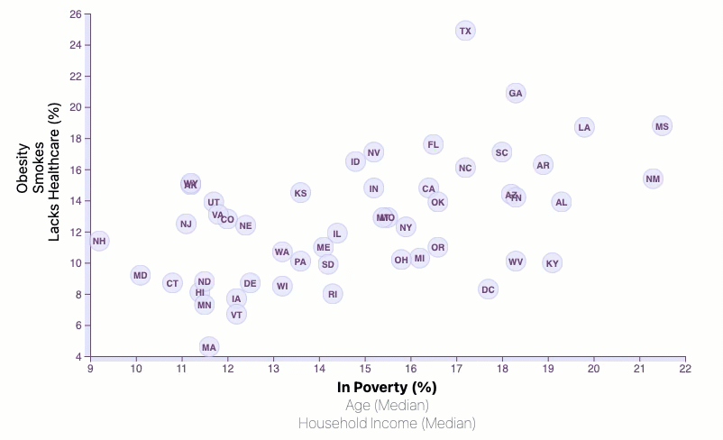

# D3-challenge

## Tiffany Harris
## SMU Data Bootcamp April 2021

* This project uses HTML, CSS, Javascript and D3. 

* The dataset, pulled from the US Census Bureau, contains information by state for % of populations that are obese, smoke, lack healthcare, in poverty, median age, and median income.

* The data is represented in a D3 scatter chart. The Xaxis has transitions applied to 3 different data points: poverty, age and income. The user can click on any of these three labels to change the scatter plot data displayed.

* A copy of the original Census Bureau dataset can be found in the [data folder](./data/data.csv).

* The index.html is the main and only html page utilizing bootstrap and a custom CSS file located in the [css folder](./css/style.css).

* The javascript and D3 programming is located in the [js subfolder of static](./static/js/app.js). 

